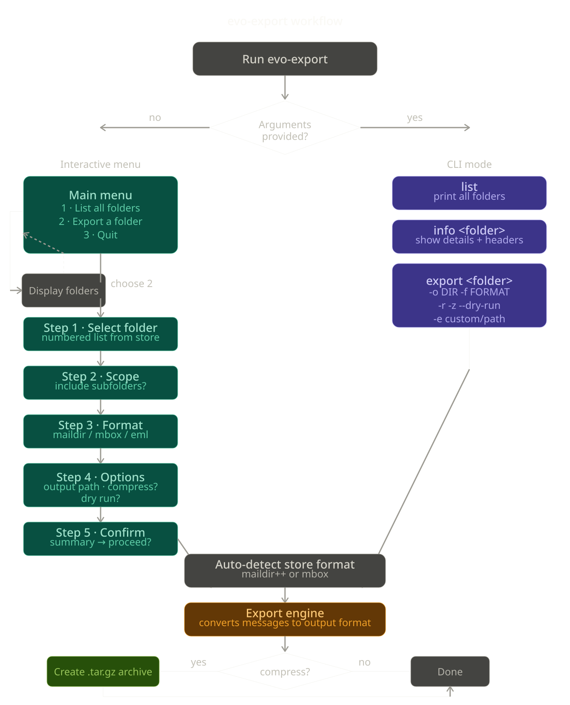

# evolution-export

**Export GNOME Evolution local mail folders to portable, standards-compliant formats.**

Evolution's built-in export options are limited — there is no right-click export for folders, and the `--export` CLI flag does not cover local mail. `evo-export` fills that gap by reading Evolution's local mail store directly and converting it to formats that work with any mail client or archival tool.

---

## Features

- **Interactive menu** for guided, step-by-step export — no flags to memorise
- **Full CLI** for scripting, automation, and power users
- **Auto-detects** Evolution's storage format (Maildir++ or mbox)
- Exports to **Maildir**, **mbox**, or **individual EML files**
- **Optional tar.gz compression** of the output directory (`-z` / menu option)
- **Recursive subfolder support** — export an entire folder tree in one command
- **Dry-run mode** — preview exactly what will be exported before writing anything
- Correctly handles Evolution's **Camel `_XX` hex name encoding**
- Zero dependencies — standard Python 3 library only

---

## Compatibility

| Component | Supported |
|---|---|
| GNOME Evolution | 3.x (tested on 3.36+) |
| Storage formats | Maildir++ (modern), mbox (legacy) |
| Python | 3.10 or later |
| OS | Linux (any distribution) |

---

## Installation

```bash
git clone https://github.com/your-username/evo-export.git
cd evo-export
chmod +x evo-export.py
```

To make it available system-wide:

```bash
sudo cp evo-export.py /usr/local/bin/evo-export
```

No pip install or virtual environment required.

---

## Before you start

**Shut Evolution down before running any export.** Evolution holds intermittent locks on its mail store, and an open client can corrupt an in-progress copy.

```bash
evolution --force-shutdown
# or
pkill evolution
```

---

## Workflow

The diagram below shows both paths through the tool — the interactive menu (left) and the direct CLI (right). Both converge at the same export engine.



> **Tip:** Export the workflow diagram from this README's `docs/` folder, or generate it from the source SVG in the repository.

---

## Interactive menu

Run the script with no arguments to launch the guided menu:

```bash
./evo-export.py
```

The menu auto-detects your Evolution mail store and walks you through five steps:

```
══════════════════════════════════════════════════════
  evo-export  ·  Evolution Mail Export Tool
══════════════════════════════════════════════════════
  Store : /home/user/.local/share/evolution/mail/local
  Format: maildir++
──────────────────────────────────────────────────────

  1. List all mail folders
  2. Export a folder
  3. Quit

  Choose an option [1-3]:
```

### Step 1 — Select folder

Discovered folder groups are listed and numbered. Enter the number for the group you want to export.

```
══════════════════════════════════════════════════════
  evo-export  ·  Evolution Mail Export Tool
══════════════════════════════════════════════════════
  Store : /home/user/.local/share/evolution/mail/local
  Format: maildir++
──────────────────────────────────────────────────────
  STEP 1 OF 5 — Select folder to export

  1. Archive
  2. Drafts
  3. Sent
  4. Templates

  Select a folder group [0-4]:
```

### Step 2 — Scope

If the selected folder has subfolders, you are asked whether to include them.

```
  STEP 2 OF 5 — Scope  (Archive)

  Found 6 folder(s) under 'Archive'
  (5 subfolder(s) available)

  Include subfolders? [Y/n]:
```

### Step 3 — Output format

```
  STEP 3 OF 5 — Output format  (Archive)

  1. maildir  — One file per message (lossless; best for long-term archival)
  2. mbox     — One file per folder  (Thunderbird, Apple Mail, Mutt)
  3. eml      — Individual .eml files (maximum portability)

  Choose output format [0-3]:
```

### Step 4 — Options

```
  STEP 4 OF 5 — Options  (Archive → maildir)

  Output directory (default: /home/user/mail-backup/Archive):
  Compress output to .tar.gz when done? [y/N]:
  Dry run only (no files written)? [y/N]:
```

### Step 5 — Confirm

A full summary is shown before anything is written. Enter `n` to cancel safely.

```
  STEP 5 OF 5 — Confirm export

  Folder       : Archive
  Subfolders   : yes
  Folders      : 6
  Messages     : 751
  Output format: maildir
  Output path  : /home/user/mail-backup/Archive
  Compress     : yes (.tar.gz)
  Dry run      : no

  Proceed with export? [Y/n]:
```

---

## CLI reference

```
evo-export [-e DIR] [-v] {list,info,export} ...
```

Run with no arguments to launch the interactive menu instead.

### Global options

| Option | Description |
|---|---|
| `-e DIR`, `--evolution-dir DIR` | Path to Evolution's local mail directory. Defaults to `~/.local/share/evolution/mail/local` |
| `-v`, `--verbose` | Enable debug-level logging |

---

### `list`

List all discovered local mail folders with message counts and sizes.

```bash
evo-export list
```

**Example output:**

```
Evolution local mail store: /home/user/.local/share/evolution/mail/local
Storage format: maildir++

  LOGICAL NAME                                  FILESYSTEM NAME                               MSGS        SIZE
  ──────────────────────────────────────────────────────────────────────────────────────────────────────────────
  [Archive]                                     .Archive                                         0       0.0 B
    Inbox                                       .Archive.Inbox                                 412      18.3 MB
    Sent                                        .Archive.Sent                                  187       6.1 MB
    Sent Items                                  .Archive.Sent Items                             94       3.2 MB
    General Communications                      .Archive.General Communications                 58       1.4 MB
    Submissions                                 .Archive.Submissions                             0       0.0 B

  [Drafts]                                      .Drafts                                          3      12.0 KB
  [Sent]                                        .Sent                                          203       8.7 MB

  Total: 8 folders | 957 messages | 37.7 MB
```

---

### `info`

Show folder structure, message counts, and a sample of message headers.

```bash
evo-export info Archive
```

---

### `export`

Export a folder group to the chosen output format.

```bash
evo-export export <folder> -o <output_dir> [options]
```

| Option | Description |
|---|---|
| `-o DIR`, `--output DIR` | **Required.** Output directory (created if it does not exist) |
| `-f FORMAT`, `--format FORMAT` | Output format: `maildir` (default), `mbox`, or `eml` |
| `-r`, `--recursive` | Include all subfolders |
| `-z`, `--compress` | Compress the output directory to a `.tar.gz` archive after export |
| `--dry-run` | Show what would be exported without writing any files |

---

## Output formats

| Format | Best for | Importable by |
|---|---|---|
| `maildir` | Long-term archival, lossless from Maildir++ stores | Thunderbird, Dovecot, Mutt, Claws Mail, Evolution |
| `mbox` | Broad compatibility, single file per folder | Thunderbird, Apple Mail, Mutt, Claws Mail, Gmail import tools |
| `eml` | Manual inspection, one-off imports, forensic use | Virtually every mail client; readable as plain text |

### Choosing a format

- If your Evolution store is already **Maildir++** (the modern default on Debian/Ubuntu/Fedora), export as **`maildir`** — it is a direct file copy with no conversion, preserving all message flags.
- Use **`mbox`** if you are migrating to Thunderbird, Apple Mail, or any client with a built-in mbox importer.
- Use **`eml`** if you want individual message files you can search, inspect, or import one at a time.

---

## Compression

When compression is enabled (menu option or `-z` flag), `evo-export` creates a `.tar.gz` archive of the entire output directory immediately after the export completes.

The archive is named `<output_directory_name>.tar.gz` and placed alongside the output directory. The uncompressed output directory is preserved unless you remove it manually.

```bash
# Export Archive folder as mbox, then compress
evo-export export Archive -o ~/mail-backup -f mbox -r -z
```

**Output:**

```
INFO     Exporting 6 folder(s) -> mbox
INFO       mbox: Archive/Inbox -> /home/user/mail-backup/Archive/Inbox.mbox
INFO         412 messages (18.3 MB)
...
INFO     Compressing /home/user/mail-backup/Archive -> /home/user/mail-backup/Archive.tar.gz ...
INFO     Archive created: /home/user/mail-backup/Archive.tar.gz (4.1 MB)

=======================================================
Export complete
  Folders processed  : 6
  Messages exported  : 751
  Data processed     : 37.2 MB
  Errors             : 0
  Output directory   : /home/user/mail-backup/Archive
  Archive created    : /home/user/mail-backup/Archive.tar.gz
=======================================================
```

---

## CLI examples

```bash
# Launch interactive menu
./evo-export.py

# Discover all folders
evo-export list

# Inspect a folder group
evo-export info Archive

# Dry-run: verify scope without writing anything
evo-export export Archive -o ~/mail-backup --dry-run -r

# Lossless export (Maildir++ source → Maildir output)
evo-export export Archive -o ~/mail-backup -f maildir -r

# Export as mbox, then compress to Archive.tar.gz
evo-export export Archive -o ~/mail-backup -f mbox -r -z

# Export as individual EML files, verbose logging
evo-export export Archive -o ~/mail-backup -f eml -r -v

# Export only the root folder (no subfolders)
evo-export export Archive -o ~/mail-backup -f mbox

# Use a non-default Evolution mail directory
evo-export -e /path/to/evolution/mail/local list
```

---

## Importing the exported mail

### Thunderbird
1. Install **ImportExportTools NG** (Add-ons Manager → search for it).
2. Right-click a folder → **ImportExportTools NG**.
   - For mbox: **Import mbox file**
   - For Maildir or EML: **Import all messages from a directory**

### Apple Mail
1. **File → Import Mailboxes…**
2. Choose **Files in mbox format** and select the exported `.mbox` file.

### Mutt / NeoMutt
Point `mbox` or `maildir` at the exported path in your configuration file.

### Another Evolution instance
1. **File → Import…** → **Import a single file**
2. Select an `.mbox` file, or configure the exported Maildir directory as a new local mail source.

### Dovecot (server import)
Copy the exported Maildir directory into your Dovecot mail location. Dovecot indexes it automatically on next access.

---

## How it works

Evolution's Camel mail library stores local mail in one of two formats:

**Maildir++ (modern default on Debian/Ubuntu/Fedora 3.x):**

- The mail store root is itself a Maildir (`cur/`, `new/`, `tmp/`)
- Each folder is a dot-prefixed directory: `.FolderName/`
- Nested folders use dot-separated names: `.Parent.Child/`
- The root-level name component is Camel hex-encoded (`_XX`), e.g. `my_folder` → `my_5Ffolder`
- Subfolder name components after the root are stored literally
- A `..maildir++` sentinel file marks the store root

**mbox (legacy installations):**

- Each folder is a single file in the standard Unix mbox format
- Subfolder trees use a `.sbd/` sibling directory convention
- All name components use Camel `_XX` encoding

`evo-export` detects the format automatically, then applies the appropriate reader and the writer matching your chosen output format.

---

## Known limitations

- **IMAP accounts** are not supported. This tool only reads Evolution's **local mail** store. Remote IMAP folders are managed by the server and should be migrated using standard IMAP-to-IMAP tools.
- **Encrypted messages** (PGP/S-MIME) are exported as-is. Decryption requires the original private key and must be done separately.
- **Attachments** are preserved inside the message files — no separate extraction is performed.
- The `folders.db` SQLite metadata database is not read. Message data comes directly from the Maildir or mbox files on disk.

---

## Contributing

Bug reports, pull requests, and tested compatibility reports for additional Evolution versions are welcome.

If you encounter a folder naming pattern or storage layout that `evo-export` does not handle correctly, please open an issue with the output of:

```bash
ls -la ~/.local/share/evolution/mail/local/
evo-export --verbose list
```

---
## Credit
If you so see fit, credit is fine. This was built by Torry Crass (plaintext) with assistance from Claude AI.

## License

UNLICENSE — see [LICENSE](LICENSE) for details.
